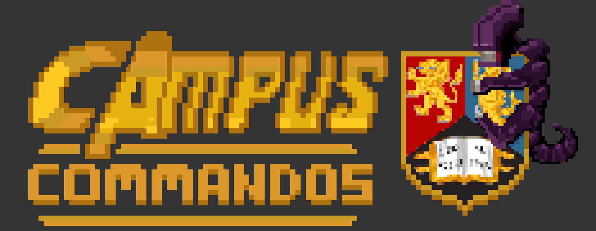
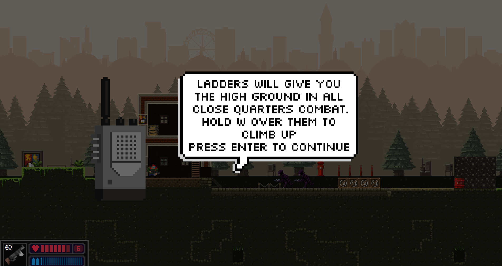
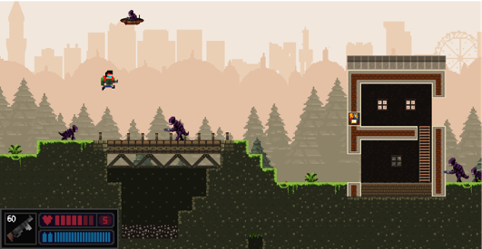
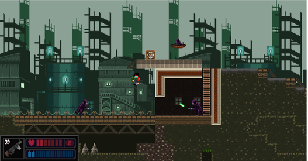
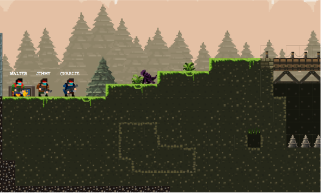

Campus commandos is a side-scrolling 2D high-action shooter that takes the player around the University of Birmingham with the aim of stopping an alien attack. The player spawns into the map as a soldier fighting their way around campus. There are 3 different game modes a user can choose from and 4 different weapon types that a user can play with; each has a separate level of destructive capability and can be used across different aspects of the game.

**Destructive environment** 

One of the main features of Campus Commandos is its destructive environment. Each map is made up of blocks, the vast majority of which can be shot, blown up and destroyed. The terrain can be manipulated in any way the user pleases, allowing the player to fully engage by creating tactical positions during gameplay.
Following an NES pixel art style, our game comes with a cooperative, competitive and survival game mode where multiple people can play online. There is also the option of playing solo, taking aliens down by yourself.

**Gamemodes**

- Campaign mode will follow the “main story” of the game, taking the player(s) through different locations of Birmingham before journeying into more fantastical places. This can be played solo or with up to 4 players.

- Competitive takes place in an arena, where players fight against each other to gain the most points by killing each other. This will be 2 - 4 players.

- Survival is a procedurally generated version of the game, where a new level is generated every time a player completes the level. The player’s health and ammo carry over between levels, so they must be careful with how they play. The goal is to survive as many levels as you can, before dying. This mode is single player.

